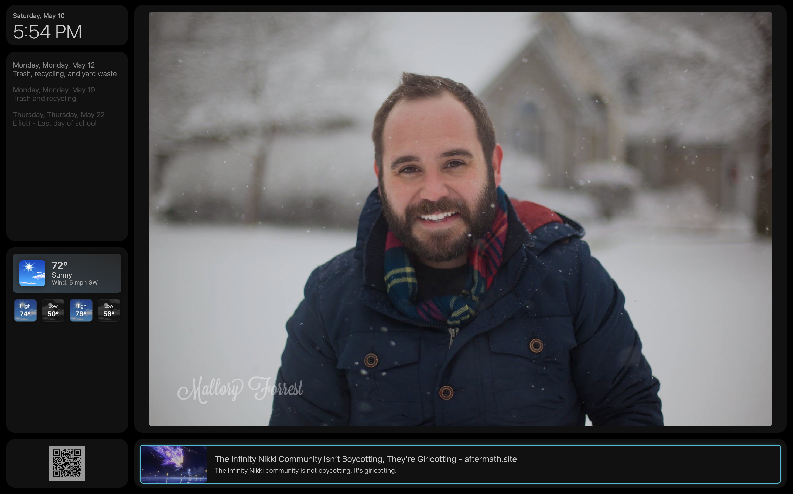

# Dashatron

This is Dashatron, a DIY dashboard for Raspberry Pi (or any browser) that pulls in stuff like weather, calendars, photos, and headlines, and displays it in your browser. Built to display on a TV, fridge screen, or whatever you’ve got laying around. It's meant to be simple in both function and use, displaying the things I wanted to see while I make coffee in the morning without having to look at my phone.  

## Why I Built This

I started with MagicMirror and liked the concept, but I hit walls trying to customize it the way I wanted: clickable elements, easier layout control, cleaner photo handling, etc. Rather than hack around someone else's structure, I'm building my own but it's a learning experience for sure.

This is mostly a personal project to learn how Node, APIs, and modular building all work together... but if you're trying to do something similar or want a cleaner base to build off of, maybe this will help. It's not perfect, but it’s mine, and now it's yours too.

As I've been hacking away at this I've had huge shifts in how I want to organize everything.  Functions have became includes then modules.  Once I built things into modules, I wanted an easier way to create new ones without having to drop files everywhere or edit a bunch of the core files so I figured out how to make them self contained until runtime.  It's a slog. I'm sure it's not all best practices. I don't care. I like it.  

## What It Does

- 📅 Pulls in multiple calendars (iCloud, Recollect (trash pick up), any standard calendar file)
- 🌤️ Current weather + hourly + 5-day via National Weather Service
- 📰 News headlines from NewsAPI.org with thumbnails and summaries
- 🖼️ Auto-rotating photo gallery with upload support from your phone
- 🕹️ CEC + arrow key navigation support (remote or keyboard)
- 🔁 APIs refresh themselves, frontend updates automatically
- 🎨 Fully stylable with your own CSS

## Limitations and future plans..

- Date & Time are not a module since I considered it a core feature. 
- QR code generates itself based on how you load the the browser, so when serving locally, don't use localhost, use the host name or ip address so that the QR code works. 
- News and Weather are built around their respective services.. The code isn't modular enough to parse other services.
- Not everything refreshes automatically yet.. at least not properly
- No documentation for booting this up automatically using pm2 yet. 
- Still implementing navigation and CEC control.  I use this on a TV and I want to bust out a mini keyboard for simple things.
- Plan on adding some links to common websites we use, mainly streaming sites.  Since I can't capture most sites in an iframe, the plan is to just open them in a new tab and then map the cec buttons to common keyboard navigation buttons.. we'll see how that goes. 
- I'll document all the CEC details as I work them out. 


## Setup (requires node.js)

1. **Install dependencies**:
   ```bash
   npm install
   ```

2. **Make a `.env` file** in the root:
   ```env
   WEATHER_LAT=...
   WEATHER_LON=...
   USER_EMAIL=...
   NEWS_API_KEY=...
   CALENDAR_URLS=... # comma-separated
   ```

3. **Start it**:
   ```bash
   npm start
   ```

4. Hit it in your browser at [http://localhost:3000](http://localhost:3000)

## Folder Layout

```
Dashatron/
├── api/          # News, weather, calendar, uploader
├── Public/       # HTML, JS, CSS, templates
├── uploads/      # Uploaded images (git-ignored)
├── .env          # Your secrets (don't commit)
├── config.js     # Constants and intervals
├── server.js     # Express app
└── package.json
```

## Versioning

Following [semver](https://semver.org/):
- Major: Breaks stuff
- Minor: Adds stuff
- Patch: Fixes stuff

## License

Creative Commons Attribution-NonCommercial 4.0 International Public License

## Screenshots


